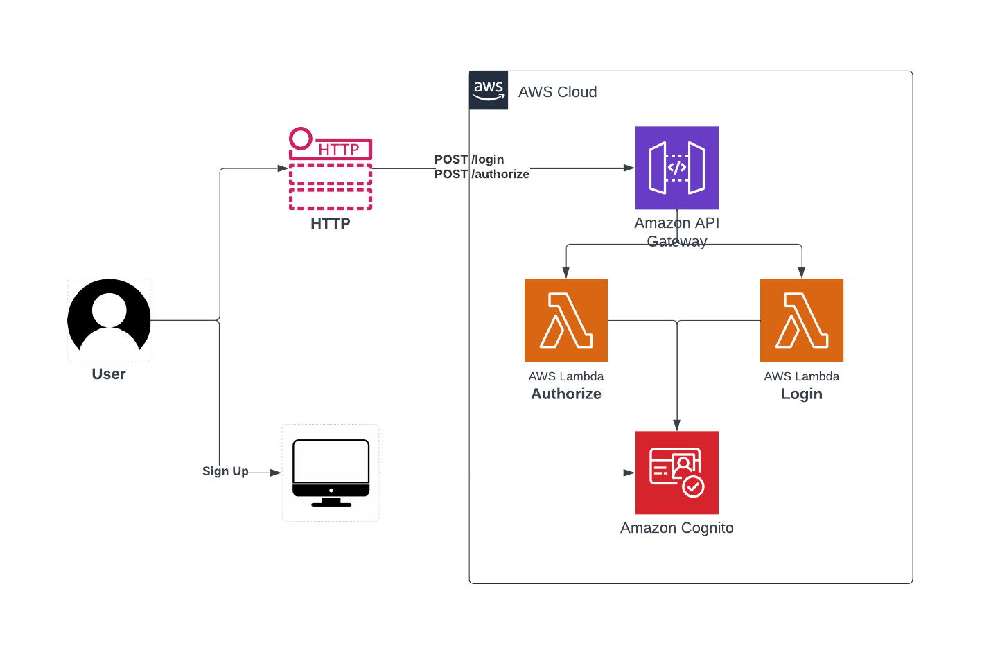
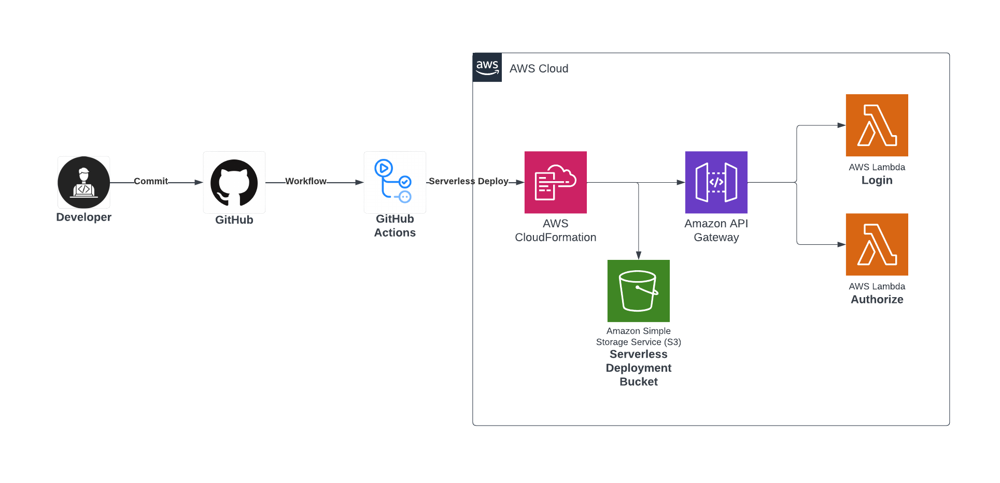

# fiap-lambda-authentication-api

## Authentication Architecture

### User Registration:
- Users can sign up by accessing the registration link: `https://fiap-user-group.auth.***.amazoncognito.com/signup***`.
- Fill out the registration form with your email and password.
- After registration, Amazon Cognito will send a confirmation code to the user's email.
- Users verify their email and confirm registration by clicking on the confirmation link.

### User Login:
- After successful registration confirmation, users can log in by accessing the login endpoint: `https://***.amazonaws.com/dev/v1/login`.
- Send the user's credentials (email and password) to this endpoint.
- The login endpoint verifies the credentials and returns an `accessToken` if the credentials are correct.
- Users receive the `accessToken` as a response.

### Using the `accessToken` for API Access:
- Users can now use the received `accessToken` to authenticate in other parts of the system.
- For example, users can make a request to the API using the `accessToken` in the authorization header (usually in the format `Bearer accessToken`).
- The API verifies if the `accessToken` is valid and authorizes the request if it is.

### Validating the `accessToken`:
- Periodically, or with each request, the API can call the authorization endpoint `https://***.amazonaws.com/dev/v1/authorize` to validate the `accessToken`.
- The authorization endpoint verifies if the `accessToken` is valid and returns a response indicating whether the `accessToken` is valid or not.

## Workflow Architecture

### GitHub Actions

GitHub Actions allows you to automate, customize, and execute software development workflows directly in your GitHub repository.

#### Prerequisites

- An AWS account
- Create an IAM user in AWS with the following permissions:
  - IAMFullAccess
  - AmazonS3FullAccess
  - CloudWatchFullAccess
  - AWSCloudFormationFullAccess
  - AWSLambda_FullAccess
  - AmazonAPIGatewayInvokeFullAccess
  - AmazonCognitoDeveloperAuthenticatedIdentities
- Securely store the AWS user access key and secret access key

#### Adding Secrets to GitHub

1. Access the settings of your forked repository on GitHub.
2. Click on "Secrets" in the left sidebar and then on "New repository secret".
3. Add your AWS API key and secret access key as secrets (`AWS_ACCESS_KEY_ID` and `AWS_SECRET_ACCESS_KEY`).
4. Add the Amazon Cognito region, user pool identifier, and client identifier as secrets (`COGNITO_REGION`, `COGNITO_USER_POOL_ID`, and `COGNITO_APP_CLIENT_ID`).

#### Starting the Workflow

After adding your secrets, commit your changes locally and push them to GitHub. The workflow will start automatically, and you can monitor its progress in the "Actions" tab of your repository.
